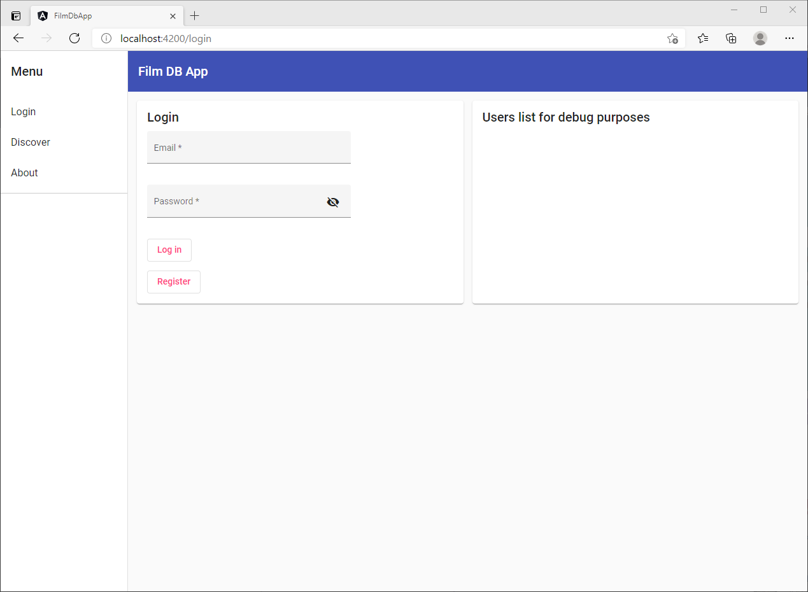
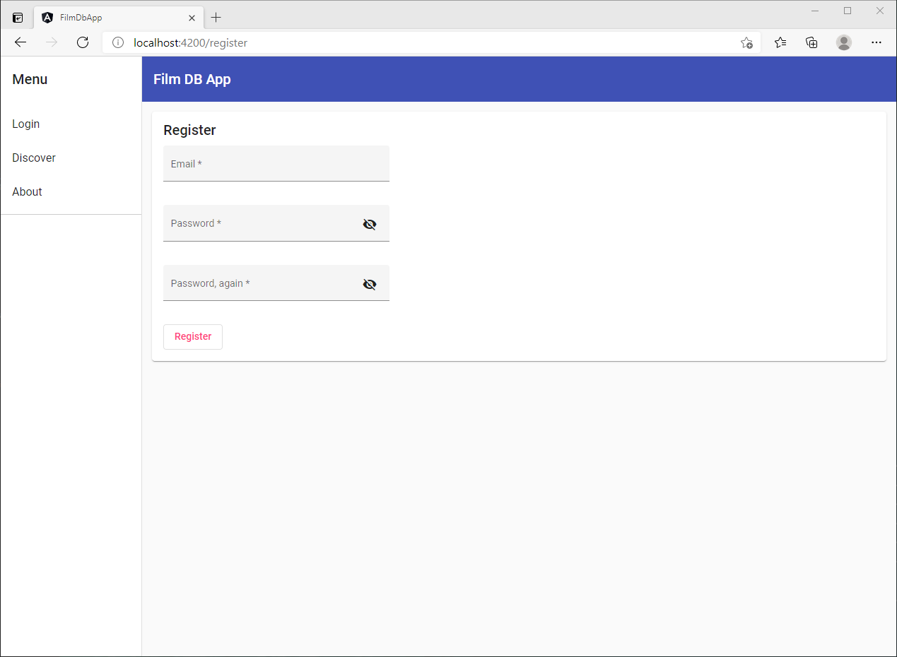
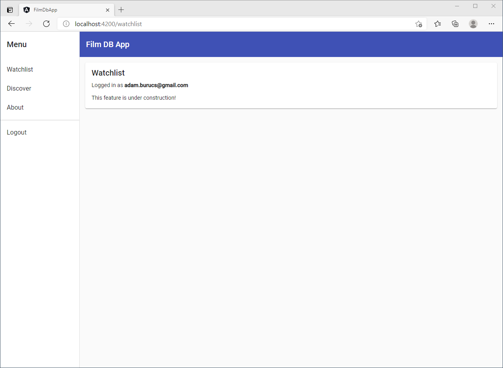
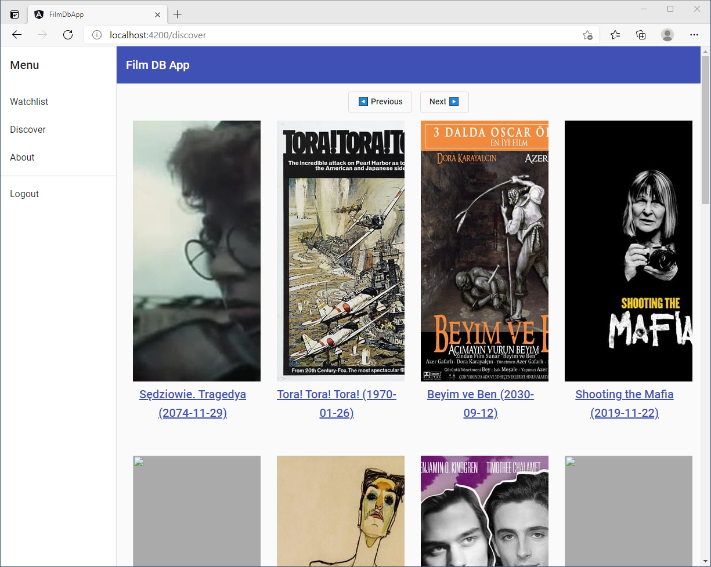
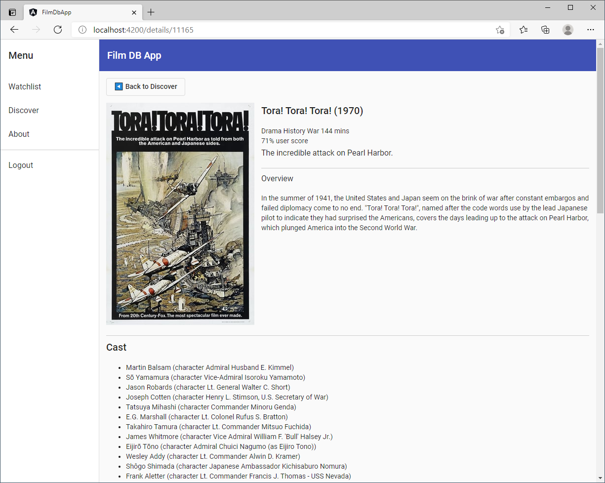
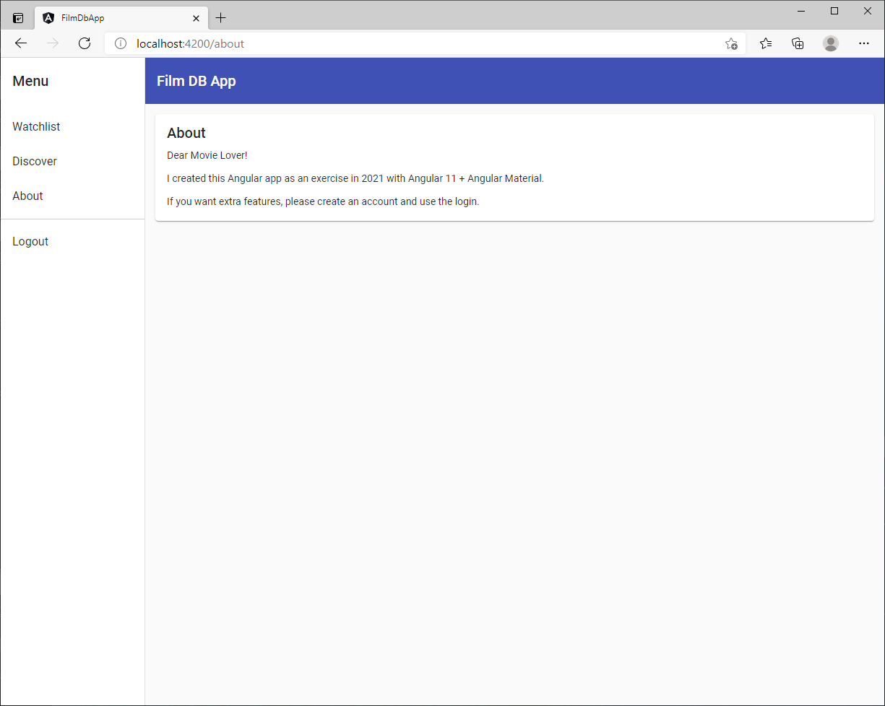

# Film DB App

With this app, you can search for movies and their details.
Using The Movie DB API: https://developers.themoviedb.org/3

## Setup

1. Open file: `src/app/environments/environment.ts`.
1. Set your API key, for example `apiKey:` "api_key=11111111111111111111111111111111"`
1. Install: `npm install`
1. Run: `ng serve`
1. Open the default address in your browser: `http://localhost:4200/`

Tested with Node.js v14.15.0 on Windows 10 Home. Made with Angular v11.2.4.

This app uses localStorage for registration, login, and current user session.

Known bugs:

- The Discover page uses descending dates, but they are off somehow.
- Some movies don't have poster images.

First version made in March 19th, 2021.

## Login

The user can log in here or move on to create an account.

## Register

The user can create an account here.

## Watchlist

This page is a work in progress; at the moment, it only shows who logged in.

## Discover

Discover lists the films by descending date, but somehow the API dates are off at some places.
Also, not every movie has a poster image.

## Details

When you click on a movie in Discover, you can watch its details.

## About

This is a simple description just to show how it would look to have such a page.

